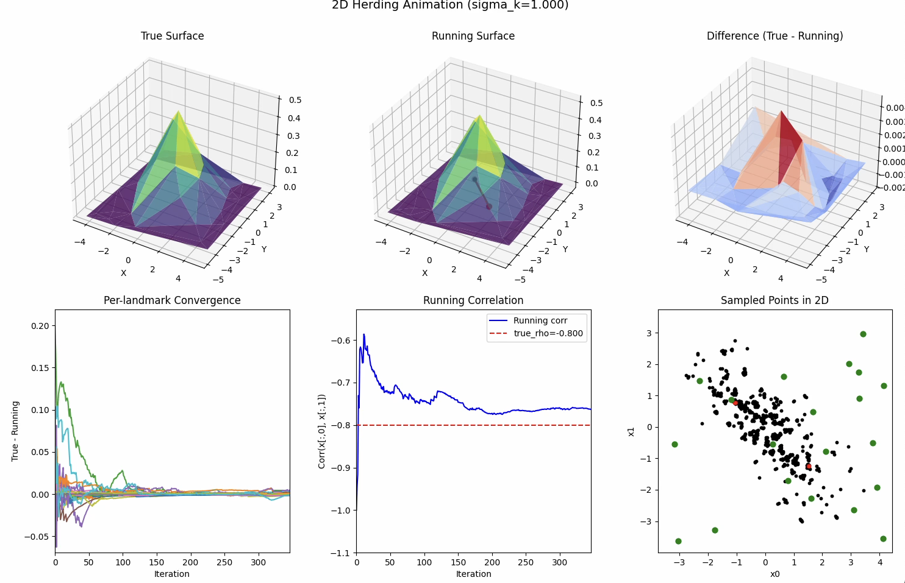

# herding
Kernel herding is a kind of quasi-monte carlo where samples are chosen successively to approximate known kernel moment constraints. 

In the video below, the green dots are landmark locations `y` and the expected value of a gaussian kernel `E[ker(x,y)]` is assumed known for the desired distribution. The samples try to approximate this distribution.  

